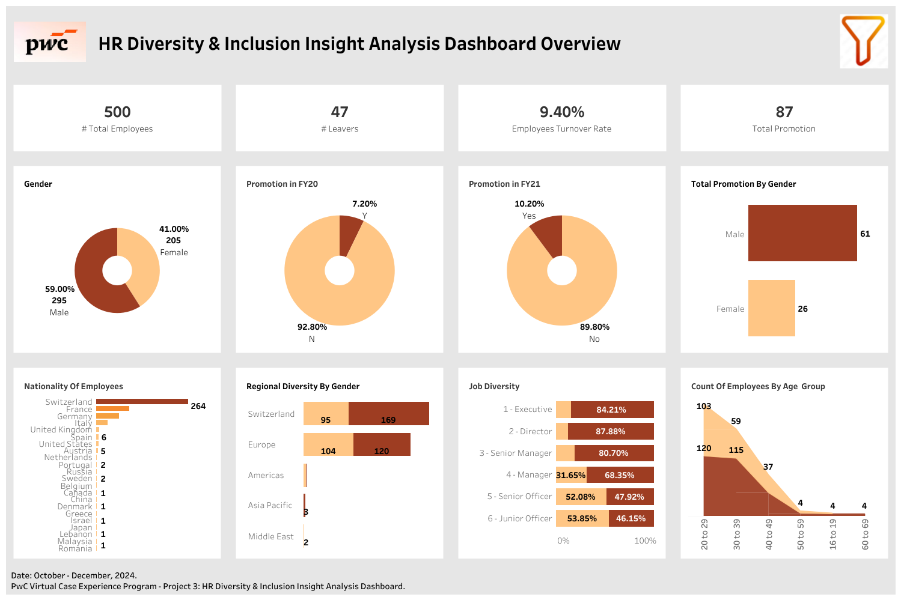

## HR Diversity & Inclusion Insight Analysis
### Project Overview
As part of the **PwC Switzerland Business Intelligence Consultant Virtual Work Experience Program**, I conducted a **diversity and inclusion analysis** for *Call Now Customer Service Company*.  
The project evaluated **workforce representation across hiring and promotion KPIs** to uncover diversity bottlenecks and propose actionable strategies for greater gender balance.

---
### The Problem
- Female under-representation was concentrated at **leadership and senior management levels**.  
- Diversity bottlenecks existed in **promotions and leadership pipelines**, limiting women’s advancement.  
- Gender imbalance was significant across executive roles, despite near parity at entry levels.  
---
### Insights
-  **Leadership Imbalance:** Over **80% of executive, director, and senior manager roles** were held by men.  
-  **Junior-Level Representation:** Females slightly outnumbered males (**53%**) at the **junior officer level**.  
-  The **promotion pipeline** revealed barriers preventing women from advancing to higher roles.  
---
### Recommendations
-  **Unconscious Bias Training:** Reduce discriminatory practices in **recruitment, evaluation, and promotion**.  
-  **Leadership Development Programs:** Tailor initiatives for women to prepare them for **managerial and senior roles**.  
-  **Mentorship & Sponsorship Initiatives:** Provide **guidance, networking, and advocacy opportunities** to aspiring women leaders.  
---
### Skills Used
- **Data Understanding** – Explored workforce representation datasets  
- **Data Cleaning** – Refined HR data for clarity and consistency  
- **Data Analysis** – Evaluated gender diversity across hierarchy levels  
- **Data Visualization** – Built dashboards to highlight diversity bottlenecks  
- **Dashboard Development** – Designed visual insights for HR strategy  
- **Data Storytelling** – Communicated actionable recommendations to stakeholders  
---
### Dashboard Preview

---
### Key Takeaway
The analysis highlighted that while **gender representation was balanced at junior levels**, severe **under-representation existed at leadership levels**.  
By addressing **biases, improving leadership development, and building sponsorship pipelines**, the company can create a more **equitable and inclusive workplace**.

---
